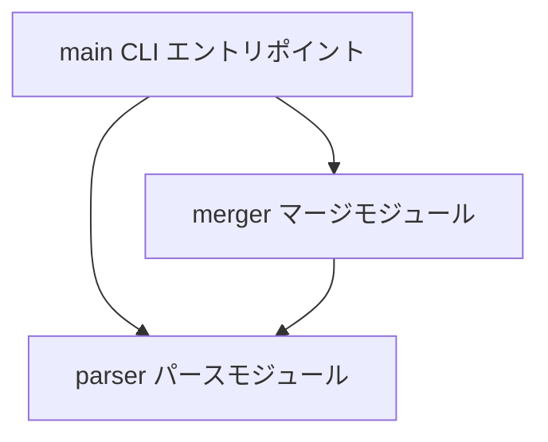
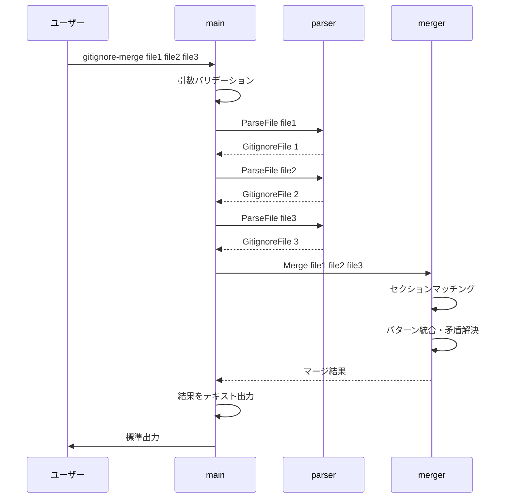
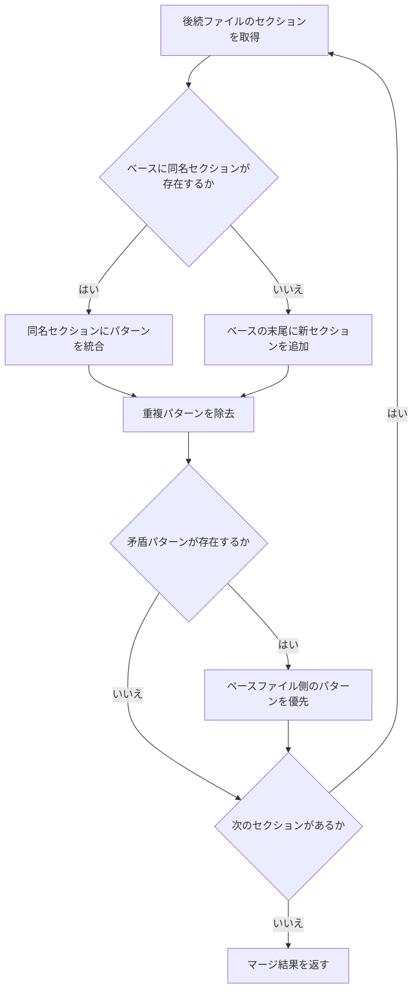
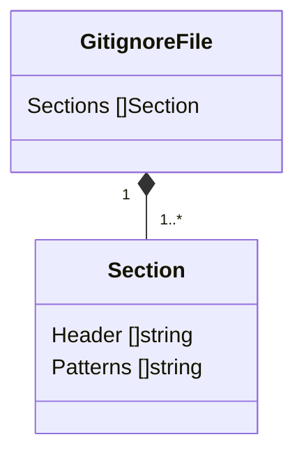

# 設計書: gitignore-merge

## 概要

**目的**: 複数の `.gitignore` ファイルをセクション単位でインテリジェントにマージするコマンドラインツールを提供する。
**ユーザー**: 開発者が、プロジェクトの `.gitignore` を複数のテンプレートや既存ファイルから統合する際に使用する。

### ゴール
- `.gitignore` ファイルをセクション（`#` コメント）単位で構造的にパースする
- 同名セクションのマッチングと統合を行う
- 矛盾するパターンの優先度解決を行う（先頭ファイル優先）
- テストとドキュメントを備える

### ノンゴール
- `.gitignore` 以外のファイル形式への対応
- GUI / Web インターフェース
- パターンマッチングの検証（実際にファイルがマッチするかの確認）

## 境界コミットメント

### 本仕様が責任を持つ範囲
- `.gitignore` ファイルのセクション付きパース処理
- 複数ファイルのセクションベースマージ処理
- マージ結果のテキスト出力
- CLI エントリポイントと引数処理
- 単体テスト・統合テスト
- README ドキュメント

### 境界外
- gitignore パターンの glob マッチング評価
- ファイルシステムのスキャン・監視
- 設定ファイルの管理

### 許可する依存
- Go 標準ライブラリ（`os`, `bufio`, `strings`, `fmt`, `flag`, `io`）
- Go テストフレームワーク（`testing`）

### 再検証トリガー
- セクション定義の変更（コメント行の認識ルール）
- マージ優先度ルールの変更
- CLI インターフェースの変更（フラグ追加等）

## アーキテクチャ

### Architecture Pattern & Boundary Map

3層レイヤードアーキテクチャを採用する。依存方向は Parser → Merger → Main の一方向。



**アーキテクチャ統合**:
- 選択パターン: レイヤード（3層）。シンプルなCLIツールに最適で、テスト容易性を確保する
- 責務分離: Parser（ファイルI/O + 構造化）、Merger（マージロジック）、Main（CLI + 出力）
- 新コンポーネントの理由: グリーンフィールドのため全て新規。各層は単一責務を持つ

**依存方向**: Types ← Parser ← Merger ← Main（左から右へのみインポート可能）

### Technology Stack

| レイヤー | 選択 / バージョン | フィーチャーでの役割 | 備考 |
|---------|------------------|-------------------|------|
| CLI | Go 標準 `flag` + `os.Args` | 引数処理、使い方表示 | 外部依存なし |
| コアロジック | Go 標準ライブラリ | パース・マージ処理 | `bufio`, `strings`, `fmt` |
| テスト | Go 標準 `testing` | 単体・統合テスト | `testdata/` にテストファイル配置 |
| インフラ | Go 1.21+ | ランタイム | Go modules |

## ファイル構造計画

### ディレクトリ構造
```
gitignore-merge/
├── go.mod                            # Go モジュール定義
├── cmd/                              # ソースコード
│   └── gitignore-merge/
│       └── main.go                   # CLI エントリポイント
├── internal/                         # 内部パッケージ
│   ├── parser/
│   │   ├── parser.go                 # パースモジュール
│   │   └── parser_test.go            # パーステスト
│   └── merger/
│       ├── merger.go                 # マージモジュール
│       └── merger_test.go            # マージテスト
├── test/                             # 統合テスト
│   ├── integration_test.go           # 統合テスト（A/B/Cマージ例）
│   └── testdata/                     # テスト用 .gitignore ファイル
│       ├── a.gitignore               # テストファイル A
│       ├── b.gitignore               # テストファイル B
│       ├── c.gitignore               # テストファイル C
│       └── expected_abc.gitignore    # A+B+C のマージ期待結果
└── docs/                             # ドキュメント
    └── README.md                     # 使い方・マージルール・入出力例
```

> `cmd/` にエントリポイント、`internal/` にコアロジック（テストは同パッケージに同居）、`test/` に統合テストとテストデータ、`docs/` にドキュメントを配置する Go の標準的なプロジェクトレイアウトを採用。

## システムフロー

### マージ処理フロー



### セクションマージロジック



## 要件トレーサビリティ

| 要件 | 概要 | コンポーネント | インターフェース | フロー |
|------|------|---------------|----------------|-------|
| 1.1 | ファイル読み込み・パース | Parser | ParseFile | マージ処理フロー |
| 1.2 | セクション区切り認識 | Parser | ParseFile | - |
| 1.3 | パターン行のセクション帰属 | Parser | ParseFile | - |
| 1.4 | 無名セクション（先頭セクション） | Parser | ParseFile | - |
| 1.5 | 空行の保持 | Parser | ParseFile | - |
| 2.1 | 複数ファイルの順番マージ | Merger | Merge | マージ処理フロー |
| 2.2 | 同名セクションの統合 | Merger | Merge | セクションマージロジック |
| 2.3 | 新規セクションの追加 | Merger | Merge | セクションマージロジック |
| 2.4 | 矛盾パターンの先頭優先 | Merger | Merge | セクションマージロジック |
| 2.5 | 重複パターンの除去 | Merger | Merge | セクションマージロジック |
| 3.1 | CLI 引数処理 | Main | main | マージ処理フロー |
| 3.2 | 標準出力への結果出力 | Main | main | マージ処理フロー |
| 3.3 | ファイル不存在エラー | Main | main | - |
| 3.4 | 引数不足エラー | Main | main | - |
| 4.1-4.5 | テスト | テストファイル群 | - | - |
| 5.1-5.3 | ドキュメント | README.md | - | - |

## コンポーネントとインターフェース

### コンポーネント一覧

| コンポーネント | レイヤー | 意図 | 要件カバレッジ | 主要依存 | コントラクト |
|--------------|---------|------|-------------|---------|------------|
| Parser | コアロジック | .gitignore のセクション付きパース | 1.1-1.5 | なし | Service |
| Merger | コアロジック | セクションベースのマージ処理 | 2.1-2.5 | Parser（型定義） | Service |
| Main | CLI | エントリポイント、引数処理、出力 | 3.1-3.4 | Parser, Merger | - |

### コアロジック

#### Parser

| フィールド | 詳細 |
|----------|------|
| 意図 | `.gitignore` ファイルをセクション構造付きでパースし、構造化データを返す |
| 要件 | 1.1, 1.2, 1.3, 1.4, 1.5 |

**責務と制約**
- ファイルの読み込みと行単位の解析
- `#` コメント行のセクションヘッダー認識
- パターン行のセクションへの帰属管理
- 空行の保持
- 構造化データ（`GitignoreFile`）への変換

**依存**
- Inbound: Main — ファイルパスを受け取りパース結果を返す
- Inbound: Merger — 型定義（`Section`, `GitignoreFile`）を使用する
- External: なし

**コントラクト**: Service [x]

##### Service Interface
```go
// Section はセクションヘッダーとそれに属するパターンを表す
type Section struct {
    // Header はセクションのコメント行（# で始まる行のスライス）
    // 無名セクション（ファイル先頭）の場合は nil
    Header []string
    // Patterns はセクション内のパターン行（空行を含む）
    Patterns []string
}

// GitignoreFile はパースされた .gitignore ファイル全体を表す
type GitignoreFile struct {
    Sections []Section
}

// ParseFile は指定パスの .gitignore ファイルを読み込み、
// セクション構造付きでパースした結果を返す
func ParseFile(path string) (GitignoreFile, error)

// Format は GitignoreFile をテキスト形式に変換する
func Format(file GitignoreFile) string
```
- 前提条件: `path` は有効なファイルパス
- 事後条件: 成功時、元ファイルの全ての行が `GitignoreFile` の構造に含まれる
- 不変条件: `ParseFile` → `Format` の往復で元ファイルの内容が保持される（末尾空行を除く）

**実装メモ**
- `#` で始まる行をセクションヘッダーとして認識する（`#`、`##`、`###` 等、`#` の個数は問わない）
- 連続する `#` 行は1つのセクションヘッダーとしてまとめる
- 空行はセクション構造を壊さず、直前のセクションの `Patterns` に含める
- ファイル先頭のパターン行は `Header` が nil の無名セクションに属する

#### Merger

| フィールド | 詳細 |
|----------|------|
| 意図 | 複数の `GitignoreFile` をセクション単位でマージし、統合結果を返す |
| 要件 | 2.1, 2.2, 2.3, 2.4, 2.5 |

**責務と制約**
- 先頭ファイルをベースとし、後続ファイルを順番にマージする
- 同名セクションのマッチング（ヘッダーの最初の行で比較）
- セクション内のパターン統合と重複除去
- 矛盾パターン（`path` vs `!path`）の先頭ファイル優先解決

**依存**
- Inbound: Main — 複数の `GitignoreFile` を受け取りマージ結果を返す
- Outbound: Parser — 型定義（`Section`, `GitignoreFile`）を使用する
- External: なし

**コントラクト**: Service [x]

##### Service Interface
```go
// Merge は複数の GitignoreFile を先頭ファイルベースでマージする。
// files[0] がベースとなり、files[1:] の内容が順番に統合される。
// 矛盾するパターンが存在する場合、ベースファイル側が優先される。
func Merge(files []GitignoreFile) GitignoreFile
```
- 前提条件: `files` は1つ以上の要素を持つ
- 事後条件: 戻り値には全ファイルのセクションが含まれる。重複パターンは除去済み
- 不変条件: ベースファイル（`files[0]`）のパターンは常に保持される

**実装メモ**
- セクション名の比較: ヘッダーの最初の行から先頭の `#` 文字列（`#`、`##`、`###` 等）と後続のスペースを全て除去した文字列で比較する。これにより `# Node`、`## Node`、`#Node` は全て同じセクション名「Node」としてマッチする
- 複数行ヘッダーの場合、セクション名の比較には最初の行のみを使用する
- 矛盾の判定: 完全一致する文字列 `X` と `!X` の関係のみを矛盾と見なす（単純な否定パターン）。ワイルドカードやグロブパターン間の意味的な矛盾（例: `*.log` と `!important.log`）は判定対象外とする。ベースファイルに `X` がある場合、後続の `!X` は無視される。ベースファイルに `!X` がある場合、後続の `X` は無視される
- 重複の判定: 完全一致する行を重複と見なす
- マージ順序: `files[1]`, `files[2]`, ... の順で逐次マージする

### CLI

#### Main

| フィールド | 詳細 |
|----------|------|
| 意図 | CLI エントリポイント。引数処理、パース・マージの呼び出し、結果出力を行う |
| 要件 | 3.1, 3.2, 3.3, 3.4 |

**責務と制約**
- コマンドライン引数のバリデーション（2つ以上のファイルパス必須）
- 各ファイルの存在確認とパース呼び出し
- マージ処理の呼び出し
- 結果の標準出力への出力
- エラー時の適切なメッセージ表示と非ゼロ終了コード

**依存**
- Outbound: Parser — `ParseFile` を呼び出す
- Outbound: Merger — `Merge` を呼び出す
- External: なし

**実装メモ**
- `os.Args[1:]` から位置引数としてファイルパスを取得する
- エラーメッセージは `os.Stderr` に出力する
- 成功時は `os.Stdout` にマージ結果を出力し、終了コード 0 で終了する

## データモデル

### ドメインモデル



- **GitignoreFile**: パースされた `.gitignore` ファイル全体。セクションの順序付きリストを保持する
- **Section**: 1つのセクション。ヘッダー（コメント行群）とパターン行群で構成される。ヘッダーが nil の場合は無名セクション（ファイル先頭）

### ビジネスルールと不変条件
- `GitignoreFile` は少なくとも1つの `Section` を持つ（無名セクションのみでも可）
- `Section.Header` が nil の場合、そのセクションはファイル先頭の無名セクションである
- `Section.Patterns` には空行を含むことができる（構造保持のため）

## エラーハンドリング

### エラー戦略
Go のイディオマティックなエラーハンドリング（`error` 返却）を採用する。

### エラーカテゴリと応答

| エラー | 条件 | 応答 | 終了コード |
|-------|------|------|-----------|
| 引数不足 | 引数が2つ未満 | 使い方メッセージを stderr に表示 | 1 |
| ファイル不存在 | 指定ファイルが存在しない | エラーメッセージを stderr に表示 | 1 |
| ファイル読み込みエラー | I/O エラー | エラーメッセージを stderr に表示 | 1 |

## テスト戦略

### 単体テスト
- `internal/parser/parser_test.go`:
  - セクション付きファイルのパース検証
  - 無名セクション（先頭にヘッダーなし）の処理
  - 空行の保持
  - 連続コメント行のセクションヘッダー認識
  - `Format` と `ParseFile` の往復一貫性

- `internal/merger/merger_test.go`:
  - 同名セクションのマージ
  - 新規セクションの追加
  - 重複パターンの除去
  - 矛盾パターン（`path` vs `!path`）の先頭優先
  - 3ファイル以上の逐次マージ

### 統合テスト
- `test/integration_test.go`:
  - A, B, C の3つのテストファイルをマージし、期待結果（`expected_abc.gitignore`）と一致するか検証
  - テストファイル自体がドキュメントとしても機能する（マージの具体例）
